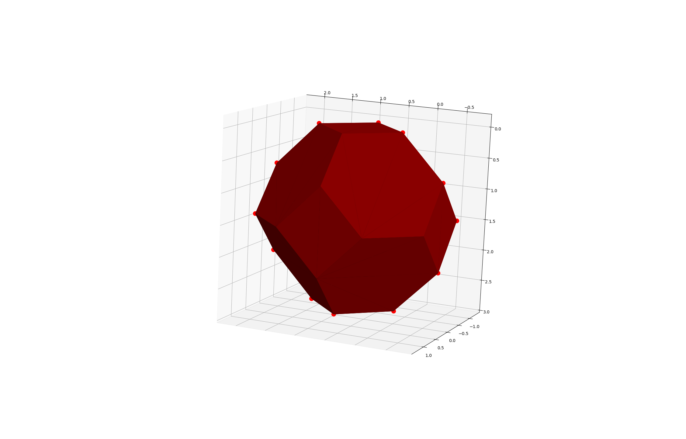
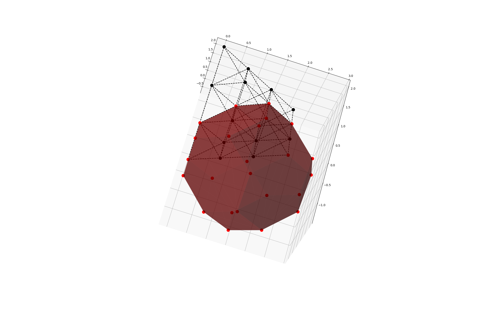
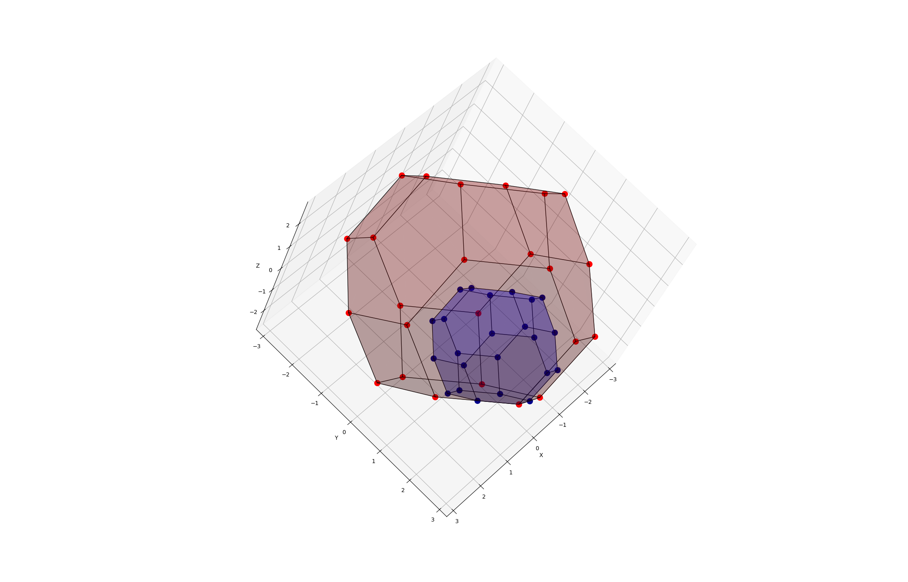

# Visualisations of FCC and HCP

These visualisations are created with matplotlib which handles 3d rather simplisticly and hence there are sometimes issues with clipping.

## Examples

#### Wulff crystal with side-length 1 in FCC

This was plotted with
```python
fcc_wulff().plot()
```

#### FCC Lattice

This was plotted with
```python
fcc(upper_bound=2.5, upper_clip_plane=5.5).plot()
```

#### Wulff crystal with side-length 1 in FCC and FCC Lattice

This was plotted with
```python
fcc(upper_bound=2.5, upper_clip_plane=5.5).plot()
fcc_wulff(opacity=0.5).plot()
```

#### Wulff crystal with side-lengths 1 and 2 in FCC

This was plotted with
```python
fcc_wulff(opacity=0.7).plot()
fcc_wulff2(opacity=0.7, color='blue', corner_color='darkblue').plot()
```

## The code

### main.py

Code to compose the different lattices and crystals using data from [data.py](#datapy) and the objects and methods from [objects.py](#objectspy) and [utils.py](#utilspy)

### data.py

The raw and slightly processed coordinates of Wulff-Crystals

### objects.py

The [Object](objects.py#L9) class represents generic graphical 3d objects. Then there are the subclasses:
- Point
- Line
- Triangle
- ObjectCollection

### utils.py

Generic functions for manipulating and generating [Object](objects.py#L9) instances and other useful functions