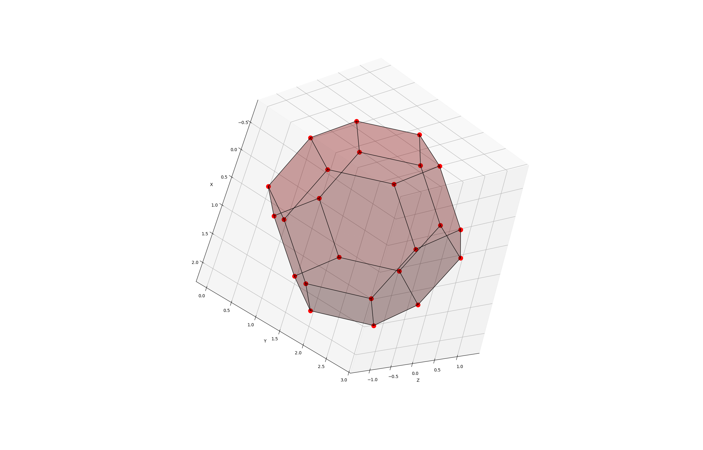
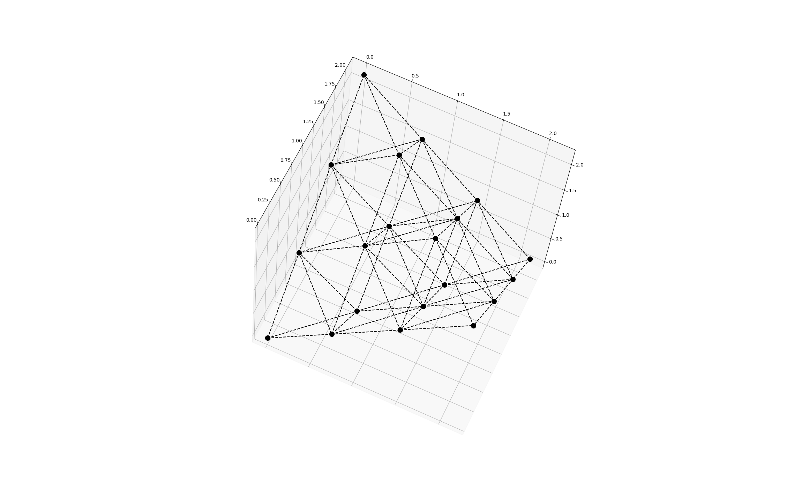

# Visualisations of FCC and HCP

These visualisations are created with matplotlib which handles 3d rather simplistically and hence there are sometimes
issues with clipping.

## Examples

#### Wulff crystal with side-length 1 in FCC


This was plotted with

```python
(auto_lines(fcc_wulff(opacity=0.2), 1)
 .foreach(Line, setter('always_on_top', True))
 .plot())
```

#### FCC Lattice


This was plotted with

```python
fcc(upper_bound=2.5, upper_clip_plane=5.5).plot()
```

#### Wulff crystal with side-length 1 in FCC and FCC Lattice


This was plotted with

```python
fcc(upper_bound=2.5, upper_clip_plane=5.5).plot()
fcc_wulff(opacity=0.5).plot()
```

#### Wulff crystals with side-lengths 1 and 2 in FCC


This was plotted with

```python
a = auto_lines(fcc_wulff(color='blue', corner_color='darkblue'), 1)
b = auto_lines(fcc_wulff2(), 2)
c = a @ b
c.foreach(Triangle, setter('opacity', 0.2))

c.plot()
```

#### Voronoi Cell (FCC)


```python
lettuce = fcc(range(-1, 2), -1.5, 1.5)
result = voronoi(lettuce, pos(0, 0, 0), 1)
result = auto_lines(result, math.sqrt(6) / 4)
result.foreach(Triangle, setter('opacity', 0.2))
result.foreach(Triangle, setter('color', 'green'))
result.foreach(Point, setter('color', 'green'))
result.plot()
```

#### Voronoi Cell (HCP)


```python
lettuce = hcp(range(-1, 2), -1.5, 1.5)
result = voronoi(lettuce, pos(0, 0, 0), 1)
result = auto_lines(result, math.sqrt(6) / 4)
result = auto_lines(result, math.sqrt(6) / 3)
result = auto_lines(result, math.sqrt(1/6))
result.foreach(Triangle, setter('opacity', 0.2))
result.foreach(Triangle, setter('color', 'green'))
result.foreach(Point, setter('color', 'green'))
result.plot()
```

## The code

### main.py

Code to compose the different lattices and crystals using data from [data.py](#datapy) and the objects and methods
from [objects.py](#objectspy) and [utils.py](#utilspy)

### data.py

The raw and slightly processed coordinates of Wulff-Crystals

### objects.py

The [Object](objects.py#L9) class represents generic graphical 3d objects. Then there are the subclasses:

- Point
- Line
- Triangle
- ObjectCollection

### utils.py

Generic functions for manipulating and generating [Object](objects.py#L9) instances and other useful functions

### The 2d graphic

